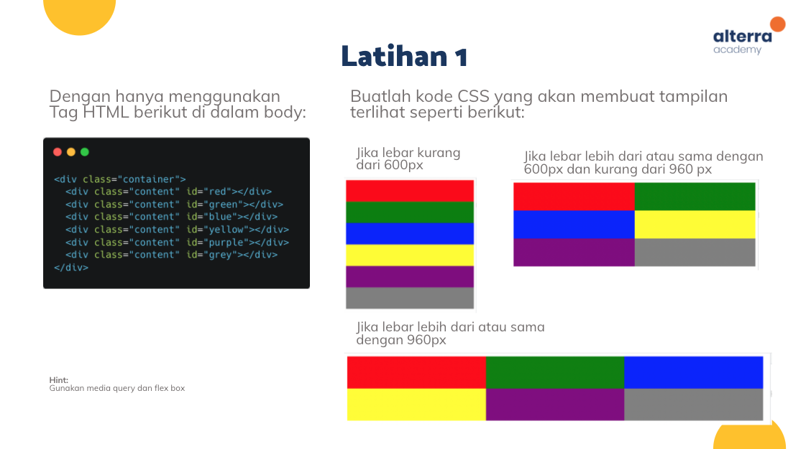
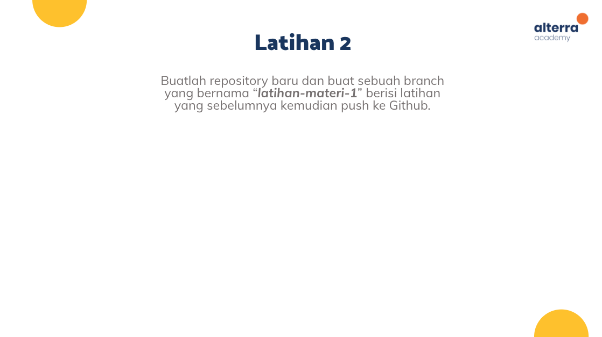
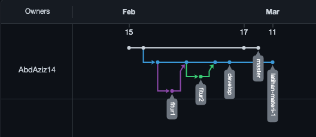

## Resume Materi 
### Frontend Fundamental

> Tuliskan 3 poin yang dipelajari dari materi tersebut. Resume / ringkasan materi dapat disubmit melalui Github
1. Semua Tentang Frontend Fundamental (HTML, CSS, JS)
2. Mempelajari Tentang Tahap awal dalam pemograman Vue yaitu NPM
3. Mempelajari tentang memakai Git

> Resume Materi
-   HTML :
    -   Singakatan dari Hypertext Markup Language
    -   HTML berfungsi Sebagai kerangka website
    -   File dengan ekstensi .html
    -   Banyak Tag pada HTML (bisa di cek di [Section 5 HTML](../5_HTML/summary.md) )
-   CSS :
    -   Singakatan dari Cascading Style Sheets
    -   CSS berfungsi sebagai Pemberi warna/style pada Sebuah Website
    -   Banyak Style pada css (bisa dicek di [Section 6 CSS](../6_CSS/summary.md) )
-   Javascript (JS) :
    -   JS berfungsi sebagai Otak yang berguna agar interaktif
    -   JS merupakan bahasa Pemograman High-Level
    -   Banyak cara penggunaan dan tag JS (bisa dicek di [Section 8 Javascrip](../8_Javascript-Refreshment/summary.md))
-   NPM : 
    -   Singkatan dari Node Package Manager
    -   Berguna sebagai Command Line yang dapat menginstall dan mengunsintall, mengelola Versi dan dependensi yang diperlukan
    -   NPM bekerja untuk mengatur package pada node.js => Package pada sebuah node.js memuat semua file yg dibutuhkan sebagai module. => Module adalah library JS yg dapat kita masukan ke proyek
-   GIT :
    -   Git merupakan salah satu sistem pengontrol versi pada sebuah proyek perangkat lunak.
    -   Bertugas mencatat setiap perubahan
    -   untuk lebih detail (bisa dicek di [Section 2 GIT](../2_Version-Control-and-Branch-Management-(git)/summary.md) )

> Task Clean Code
##### Latihan 1

##### [Jawabannya](./Praktikum/latihan1.html)

##### Latihan 2

##### [Link Git (Repo) ](https://github.com/AbdAziz14/Altera.id.git)
##### Berikut Gambar Network

