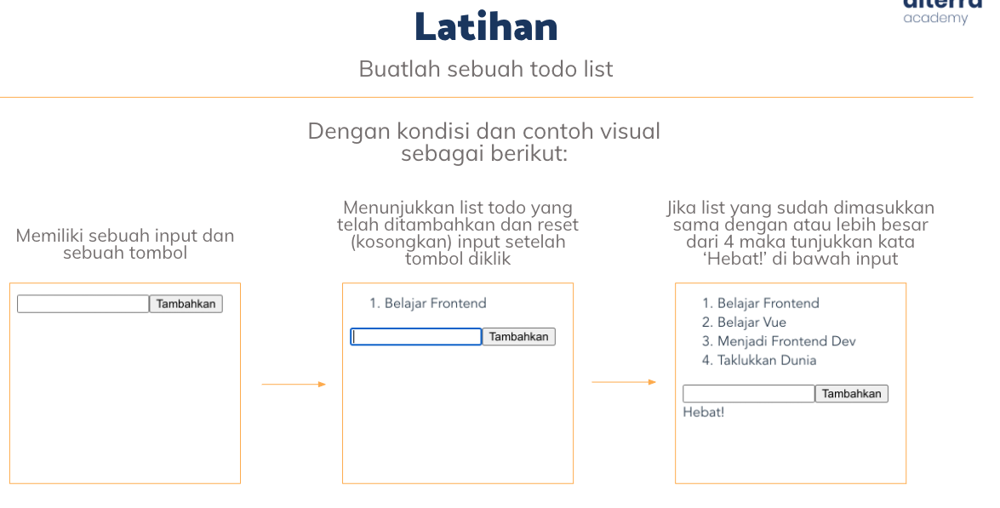

## Resume Materi 
### Vue Fundamental

> Tuliskan 3 poin yang dipelajari dari materi tersebut. Resume / ringkasan materi dapat disubmit melalui Github
1. Vue adalah sebuah framework JS yang dapat membantu website lebih interaktif dan dinamis
2. karena dinamis dan interaktif jadi ketika menggunakan vue kita tidak perlu refresh halaman tersebut
3. Dengan memakai vue banyak hal yang bisa digunakan

> Resume Materi
-   Vue merupakan Framework dari javascript untuk mengembangkan tampilan website yang lebih interaktif dan dinamis
-   Alasan kenapa memakai vue, Yaitu :
    -   Mudah membuat aplikasi frontend dan backend
    -   Mudah dipelajari dan menyenangkan
    -   Dokumentasi yang rapi dan lengkap
    -   Ramping dan Cepat
-   Vue merupakan bahasa pemograman yang populer dan sudah banyak perusahaan besar memakainya
-   Cara kerja Vue :
    1.  Vue Cdn :
        -   Vue langsung digunakan pada halaman html dengan menambahkan script cdn
    2.  Vue Cli :
        -   Menggunakan perkakas standar ekosistem vue
-   Vue Instace :
    -   menginialisasi vue dengan fungsi vue pada id app
-   Vue Data Binding :
    -   sintaks html yang mendeklarasikan dom dan dirender ke data instance vue yang mendasarinya
    -   Ada 3 Cara Data Binding :
        1.  Dalam konten
        2.  pada Atribut elemen
        3.  Elemen HTML
-   Vue Reactivity :
    -   Memiliki property data
-   Vue Directive :
    -   Sebuah atribut khusus yang diawali dengan huruf V- , yang berfungsi untuk menjalankan perintah / ekspresi JS
    -   Macam-macam :
        1.  v-bind:
            -   Directive untuk one way data binding
        2.  v-model:
            -   Directive untuk two way data binding
        3.  v-if,v-else,v-else-if :
            -   Directive untuk melakukan rendering secara kondisional
        4.  v-on:
            -   Directive untuk memanggil fungsi
        5.  v-for:
            -   Directive yang melalukan perulangan
-   Computed Properties :
    -   terlalu banyak logika secara langsung menyebabkan masalah yang intinya Template tidak lagi sederhana dan deklaratif
-   Wacther :
    -   Fitur khusus untuk memantau sebuah variabel dan melakukan tindakan tertentu ketika nilai berubah
-   Component :
    -   Sebuah komponen yang bisa digunakan kembali dengan menggunakan nama yang sesuai

> Task Clean Code
##### Soal 1

### [Jawabannya](./Praktikum/task.html)