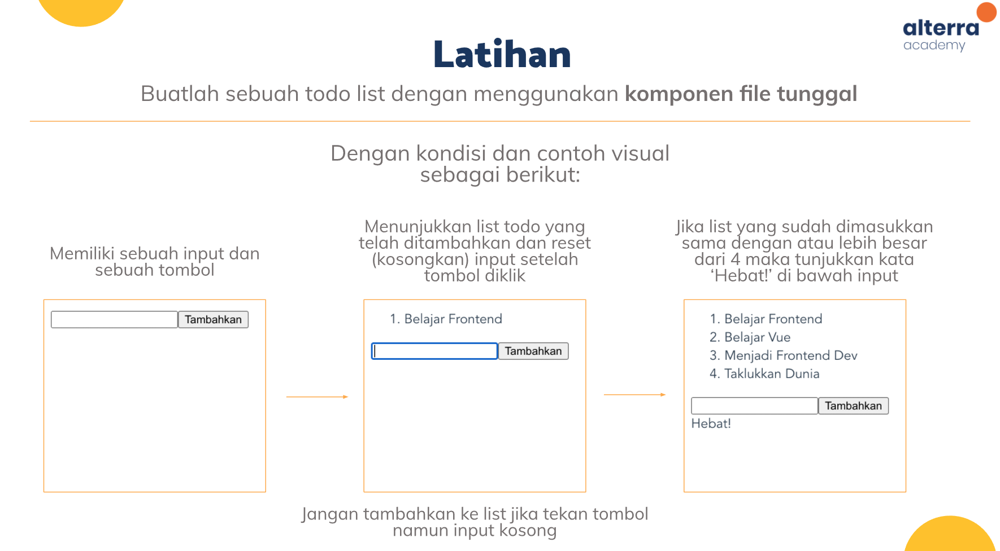
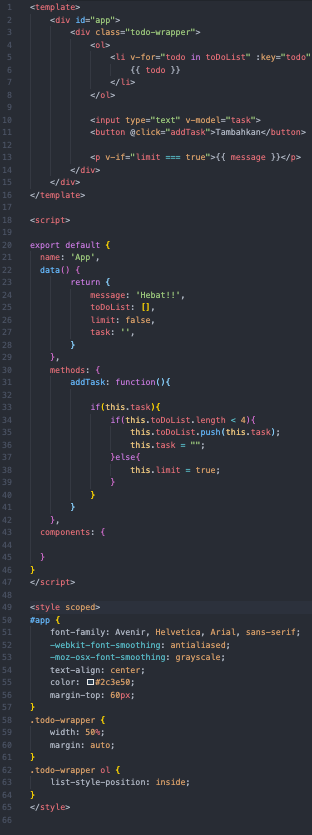
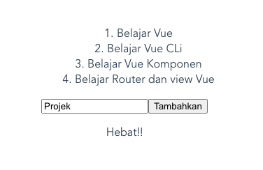

## Resume Materi 
### Vue CLI

> Tuliskan 3 poin yang dipelajari dari materi tersebut. Resume / ringkasan materi dapat disubmit melalui Github
1. Vue CLI digunakan untuk menginialisasikan sebuah projek vue
2. Vue CLI dipasang harus memakai NPM
3. Beberapa extension/perkakas dalam VSCode untuk membantu pemograman vue

> Resume Materi
-   VUE CLI Adalah perkakas standar untuk memudahkan penyetelan/pembuatan aplikasi vue
-   Webpack adalah sebuah module bundler, digunakan untuk mengabungkan seluruh modul projek aplikasi menjadi satu file
-   untuk memasang vue cli pada perangkat maka menjalankan perintah `npm instal -g @vue/cli`
-   Perintah untuk mencheck vue cli dan versinya yaitu `vue --version`
-   ada 2 cara membuat aplikasi vue baru, yaitu :
    1.  `vue create <nama aplikasi>`
    2.  `vue create .`
-   Untuk menjalankan aplikasi vue maka memakai perintah `npm run serve`
-   Beberapa extension/perkakas penting untuk membantu pengembangan pada vscode:
    1.  Vetur => Sebagai highlighter dan memberi warna pada kodingan
    2.  Linter => Sebagai alat pemindai untuk menemukan masalah bug dan ketidakkonsistenan dengan standar
    3.  Pritier => Sebagai alat penyeragaman gaya kode
    4.  Git Inspector => Sebagai perkakas yang menginfokan versi/commit yang ada pada setiap baris kode
-   Komponen file tunggal memungkinkan kita membangun seluruh komponen (struktur, gaya, dan fungsi) dalam satu file. Dan, sebagian besar editor kode menyediakan penyorotan sintaks dan linting
-   Komponen tunggal memiliki ekstensi .vue
-   Tag utama pada komponen file tunggal :
    1.  `<template>` => me-render HTML
    2.  `<script>` => Membuat javascript
    3.  `<style>` => Memuat sintaks CSS

> Task Clean Code
#### Soal 1

#### [Jawabannya](../vue-alterra/src/App.vue)

#### SS Kodingan

#### SS Hasil
