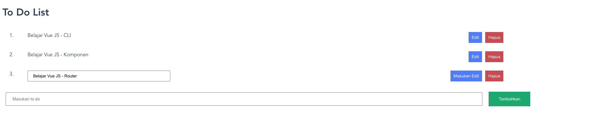

## Resume Materi 
### Vue CLI

> Tuliskan 3 poin yang dipelajari dari materi tersebut. Resume / ringkasan materi dapat disubmit melalui Github
1. Vue CLI digunakan untuk menginialisasikan sebuah projek vue
2. Vue CLI dipasang harus memakai NPM
3. Beberapa extension/perkakas dalam VSCode untuk membantu pemograman vue

> Resume Materi

> Task Clean Code
#### Soal 1

#### [Jawabannya](../vue-alterra/src/App.vue)

#### SS Kodingan

#### SS Hasil
