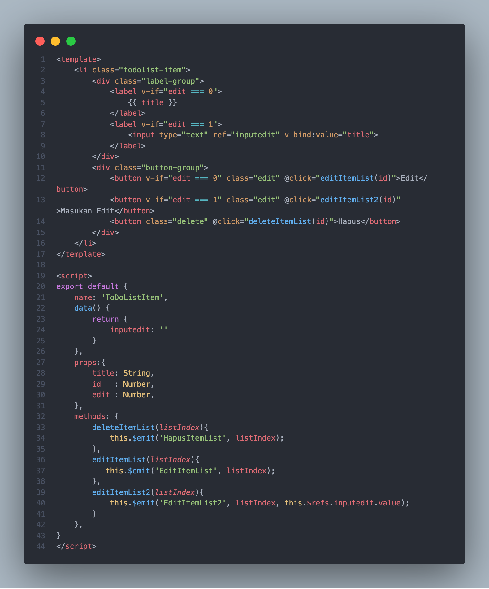

## Resume Materi 
### Komponen Vue

> Tuliskan 3 poin yang dipelajari dari materi tersebut. Resume / ringkasan materi dapat disubmit melalui Github
1. Modul yang membantu pemograman vue agar lebih ringan
2. Komponen itu sangat membantu karena bisa dipakai berulang-ulang
3. Penggunaan siklus Lifycyle

> Resume Materi
-   Module berisi kelas atau pustaka fungsi untuk tujuan tertentu
-   Perbedaan Module dan Regular Script :
    -   CJS : Mengimport semua isi
    -   ESM : Import bagian yang dibutuhkan
-   Export :
    -   Digunakan untuk menyediakan objek, fungsi, atau nilai primitf dari modul sehingga dapat digunakan oleh modul lain
    -   Ada 2 Tipe Export :
        1.   Named Export (Export 0/lebih per modul) `export const`
        2.  Default Exports (1 per modul) `export default`
-   Import :
    -   Digunakan untuk mengambil variabel, objek, atau fungsi yang disediakan oleh modul lain
    -   Ada 4 Tipe Import :
        -   Importing Default `import target`
        -   Import multiple exports `import { target}`
        -   Rename multiple exports `import { target as t}`
        -   Import defaults + multiple `import targetDefault, { target as t}`
-   Komponen Vue yang dapat digunakan kembali? ya, Sebuah Komponen File Tunggal Vue yang bertujuan untuk dapat digunakan lebih dari satu kali di tempat yang berbeda
-   Ada Beberapa cara komunikasi antara parent and child pada komponen, yaitu
    1.  Props
    2.  Emit
-   Paradigma Fungsi Pembantu
    -   Sebuah Fungsi perkakas/pembantu yang bertujuan untuk dapat digunakan lebih dari satu kali di tempat yang berbeda
-   Tips :
    -   Fungsi pembantu bisa diberi nama yang berbeda-beda namun harus mudah dimengerti, jamak dan self-descripting seperti:
        1.  Utilities
        2.  Utils
        3.  Helpers
        4.  Tools
    -   Beberapa contoh fungsi pembantu yang sering dipakai:
        1.  Operator (penambahan, rata-rata, median, min-max, hitung umur dll.)
        2.  Formatter (tanggal, waktu, mata uang dll.)
        3.  Validator (email, nomor telfon, nomor kartu kredit dll.)
        4.  Generator (angka random, text random, warna, format text dll.)
-   Instance Lifecycle Hooks
    -   Setiap Vue Instance melewati beberapa serangkaian tahapan pada saat dibuat, tahapan ini disebut sebagai Lifecycle atau siklus hidup.
    -   Siklus hidup sebuah Vue instance berawal ketika inisiasi dan berakhir ketika penghancuran.
    -   Ada 3 Lifecycle Utama, yaitu :
        1.  Created => Berlangsung setelah instance terbentuk dan sebelum DOM dirender.
        2.  Mounted => Berlangsung setelah DOM dirender.
        3.  Destroyed => Berlangsung sebelum instance dihancurkan.

> Task Clean Code

#### Soal 1

#### [Jawabannya](../vue-alterra/src/App.vue)

#### SS Kodingan

#### Vue.app

#### TodoListForm.app (Komponen)

#### TodoListItem.app (Komponen)

#### Hasil 
