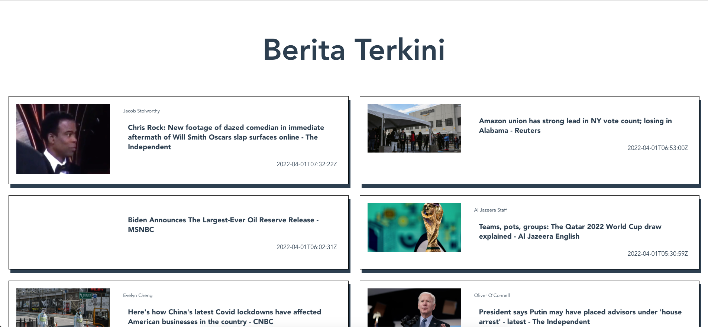

## Resume Materi 
### Vue Data

> Tuliskan 3 poin yang dipelajari dari materi tersebut. Resume / ringkasan materi dapat disubmit melalui Github
1. Penggunaan API sangt 
2. Axios merupakan dependensi yang membantu memakai API
3. Auth merupakan validasi terhadap akses sistem

> Resume Materi
-   Data Fetching
    -   Pengambilan data oleh program perangkat lunak atau skrip. Setelah diambil, data dipindahkan ke lokasi alternatif atau ditampilkan di layar.
    -   Singkatan dari Application Programming Interface yaitu sebuah protokol pada dasarnya menýyediakan bahasa dan kontrak untuk bagaimana dua sistem berinteraksi.
    -   Saat API berinteraksi dengan sistem lain, titik kontak dari komunikasi ini dianggap sebagai Endpoint, yang berbentuk Link
    -   Axios adalah sebuah pustaka yang dipakai front-end untuk melakukan HTTP Request kepada link API Endpoint.
    -   Jika Request adalah permohonan pengambilan data maka Request Queries adalah syarat yang menyatakan data seperti apa yang ingin diambil.
-   Data Error
    -   JavaScript adalah bahasa yang memiliki tipe data dinamis.
    -   Tidak memberikan kesalahan ketika kompilasi, jadi beberapa kali kita akan mendapatkan runtime-error untuk mengakses variabel atau fungsi yang undefined.
    -   Penanganan data error adalah konsep untuk mencegah terjadinya runtime-error
    -   Objek Promise mewakili penyelesaian (atau kegagalan) akhirnya dari operasi asinkron dan nilai yang dihasilkannya.
    -   Aktivitas berkomunikasi dengan API pada umumnya berbentuk promise
-   Validasi Data
    -   Adalah konsep untuk melakukan pengecekan terhadap data apakah sudah sesuai dengan kriteria atau belum, terutama pada input pengguna.
    -   Fungsi validasi menerima nilai yang ingin dicek kemudian mengembalikan nilai keabsahan/validity berupa nilai boolean (true/false)
    -   Regex :
        -   Regex adalah singkatan dari Regular Expression.
        -   Regex merupakan sebuah teks (string) yang mendefinisikan sebuah pola pencarian sehingga dapat membantu kita untuk melakukan matching (pencocokan) dan locate (pencarian).
-   Autentikasi
    -   Suatu proses yang menjadi tindakan atau pembuktian (validasi) terhadap identitas pengguna ketika ingin memasuki dan mengakses sistem tertentu.
    -   Pengguna A mengirimkan kredensial yang biasanya berupa kombinasi username dan password, jika cocok maka server akan mengirim akses token di mana token tersebut adalah pembuktian mutlak kalau pengguna A adalah pengguna A bukan pengguna B, C atau yang lain.
    -   Otoritasi :
        -   Pengguna A mengirimkan kredensial yang biasanya berupa kombinasi username dan password, jika cocok maka server akan mengirim akses token di mana token tersebut adalah pembuktian mutlak kalau pengguna A adalah pengguna A bukan pengguna B, C atau yang lain.

> Taks Vue Data
#### Soal
##### [Link Soal](https://docs.google.com/presentation/d/1tN3kmiJbsFtmUFuI2j_CfHTSu0dunRH6BlQJE-wrg_Y/edit#slide=id.g8bce5440c3_0_0)

#### Jawaban
#### [To Do List App](../news-app/src/App.vue)

#### SS Output

