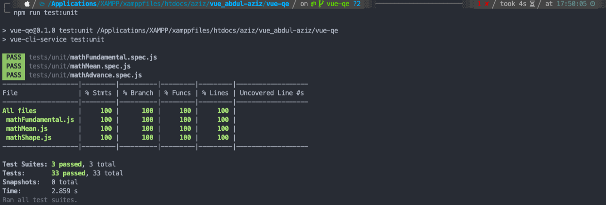

## Resume Materi 
### Vue Quality Control

> Tuliskan 3 poin yang dipelajari dari materi tersebut. Resume / ringkasan materi dapat disubmit melalui Github
1. untuk memudahkan kita mengindentifikasi quality
2. agar kita membuat project dengan hati hati dan efisien
3. bisa mengindentifikasi masalah sendiri

> Resume Materi
-   Debugging
    -   Proses mengidentifikasi dan menghilangkan kesalahan dari perangkat lunak komputer.
    -   Cara kerja :
        1.  Indentifikasi Kesalahan
        2.  Identifikasi Solusi
-   Unit testing
    -   Proses verifikasi bahwa kode kita benar-benar berperilaku seperti yang diharapkan dan validasi bahwa kode kita tetap benar sepanjang masa aplikasi.
    -   Unit Testing memberikan kita kesempatan untuk menguji potongan kode secara individual dan terisolasi dalam bentuk Test Assertion
    -   Test assertion ini adalah ekspresi boolean yang mengembalikan nilai true kecuali ada kesalahan atau perilaku yang tidak diharapkan di kode kita
    -   Perkakas Unit Testing :
        1.  Jest
        2.  Mocha
-   Jest
    -   Jest adalah salah satu kerangka kerja untuk melakukan Unit Testing pada aplikasi yang berbasis Javascript
-   Matriks Ukur Kinerja
    -   Tolak ukur penting yang menunjukkan informasi seberapa baik kinerja aplikasi kita
    -   Dengan bantuan sebuah perkakas yang menjalankan serangkaian pemeriksaan sebelum menghasilkan laporan terperinci dan skor tentang seberapa baik kinerja halaman.
    - Lighthouse Audit
        -   Adalah perkakas yang membantu menentukan skor pada matriks ukur kinerja aplikasi web
-   Mengoptimalkan Kinerja
    -   Proses untuk meningkatkan kinerja aplikasi web berdasarkan informasi skor matriks ukur
    -   Apa Itu Core Web Vitals?
        -   Kumpulan metrik website yang ditentukan oleh Google. Kumpulan metrik ini ditetapkan sebagai bagian dari indikator ranking pencarian terbaru Google, yaitu page experience.

> Taks Vue Quality Control
#### Soal
##### [Link Soal](https://docs.google.com/presentation/d/1veu9XSBwcXoD1J6u3KE7GorY8M1o0giQ6g_pf712WYY/edit#slide=id.g8bce5440c3_0_0)

#### Jawaban
#### [Vue Quality Control](../vue-qe/src/App.vue)

#### SS Output
