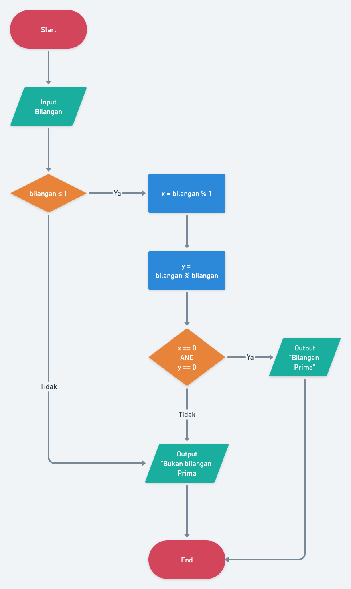
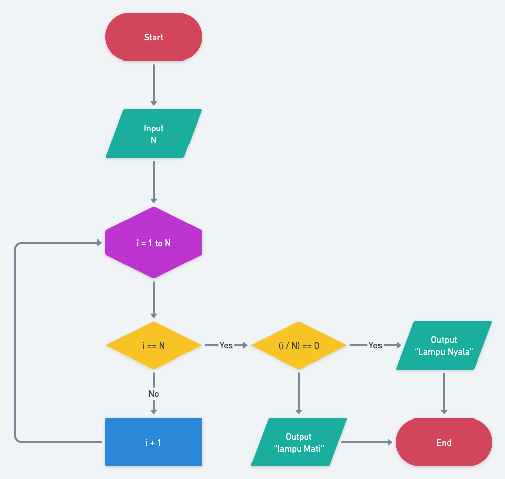

## Resume Materi 
### Introduction Algorithm

> Tuliskan 3 poin yang dipelajari dari materi tersebut. Resume / ringkasan materi dapat disubmit melalui Github
1.  Algoritma itu sebagai sebuah prosedur dalam aplikasi
2.  Pentingnya sebuah algoritma karena sebagai langkah dalam memahami maksud dan tujuan aplikasi
3.  Flowchart sebagai struktur pengembangan dalam sebuah algoritma

> Resume Materi
-   Algoritma
    -   Algoritma adalah prosedur komputasi yang didefinisikan dengan baik yang mengambil beberapa nilai sebagai input dan menghasilkan beberapa nilai sebagai output.
    -   Karakteristik
        1.   Memiliki batas Instruksi terdefinisi Efektif & Efisien (Awal dan akhir) dengan baik
        2.  Instruksi terdefinisi dengan baik,
        3.  Efektif dan Efisien
-   Flowhcart
    -   suatu bagan dengan simbol tertentu yang menggambarkan urutan dan hubungan antar proses secara mendetail.

> Taks Introduction Algorithm
#### Soal
##### [Link Soal](https://docs.google.com/document/d/1QEwLv53ARo-Gsl4URZfZ9v1e6rDpK9lQn6XdswkgV7A/edit#heading=h.19ihxai8kiry)

#### Jawaban
#### NO 1

#### NO 2
