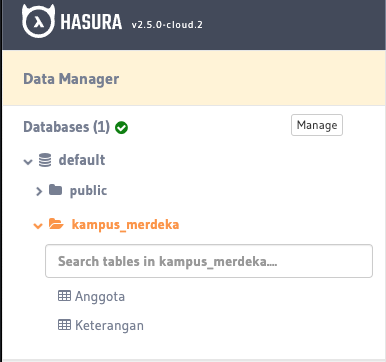
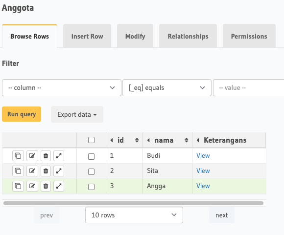
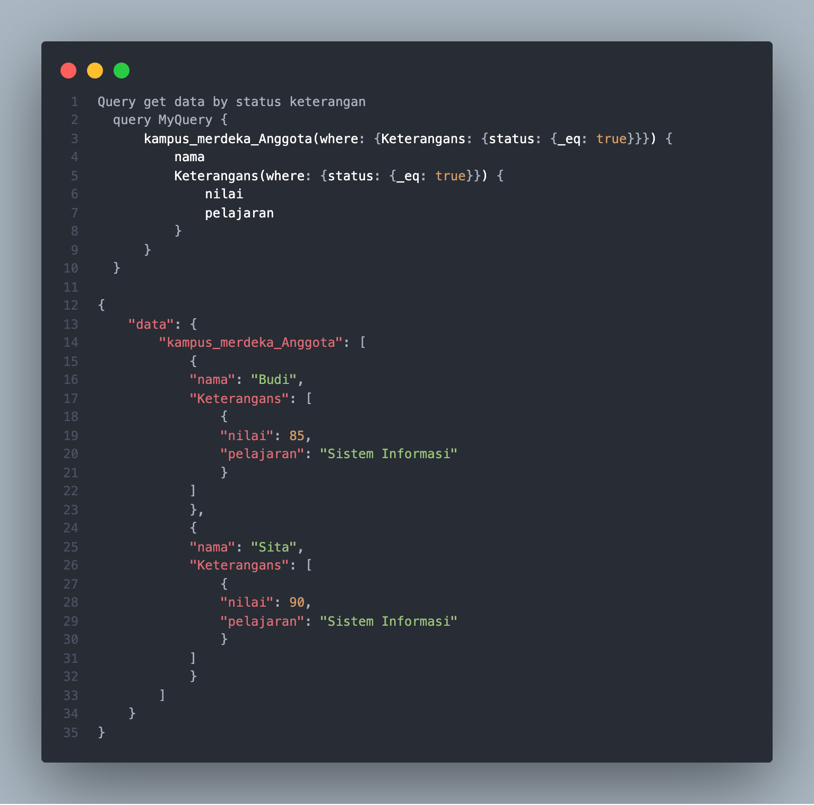
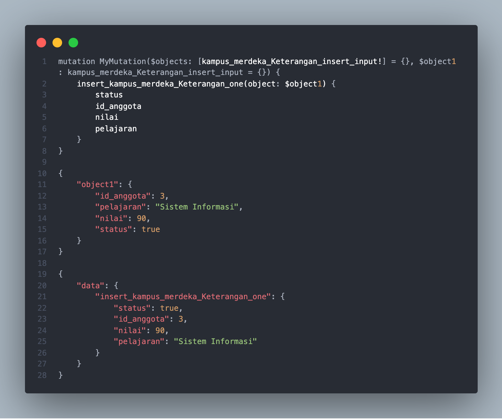
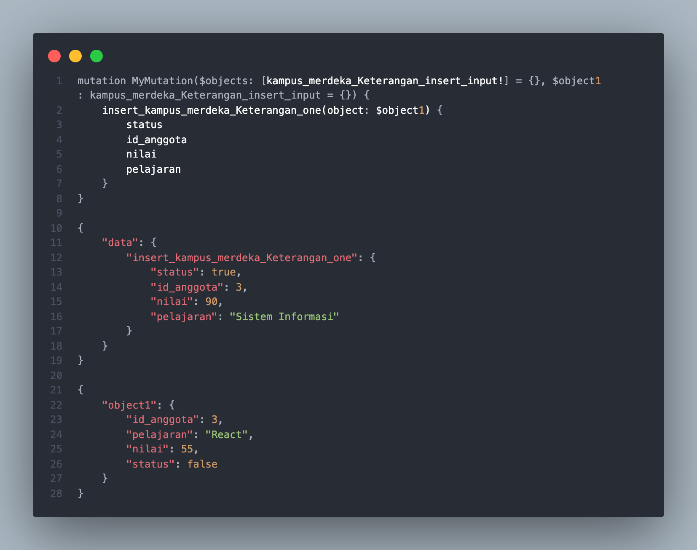
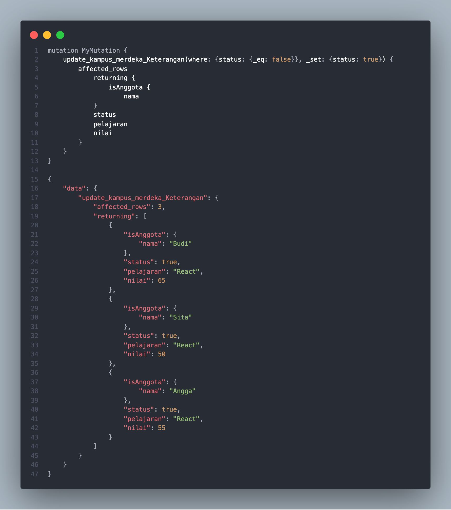
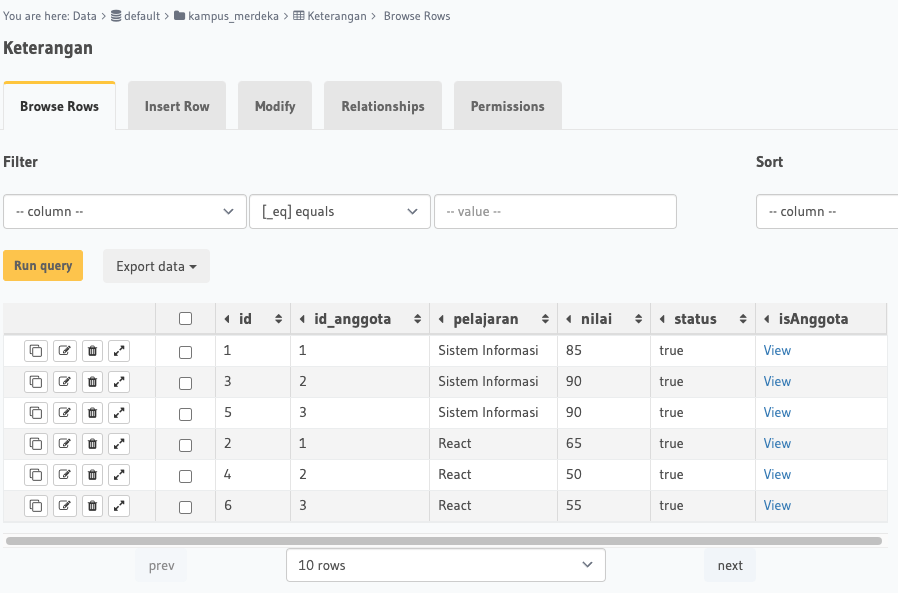

## Resume Materi 
### Understanding GraphQL Basic

> Tuliskan 3 poin yang dipelajari dari materi tersebut. Resume / ringkasan materi dapat disubmit melalui Github
1.  GraphQL sebagai database
2.  hasil dari GraphQl adalah berupa sebuah json
3.  tidak perlu banyak link untuk mengambil data seperti REST API

> Resume Materi
-   GraphQL
    -   Bahasa Query untuk API dan bejalan secara serverside 
    -   mengeksekusi query tergantung data yang anda tentukan
    -   untuk memakai graphql kita menggunakan hasura dan apollo server
    -   Ada 3 fitur utama :
        1.  Query => mengambil data
        2.  Mutation => menambah , mengubah ,dan menghapus data
        3.  Subscription  => mendapatkan data realtime berdasarkan event tertentu

> Taks Vue Quality Control
#### Soal
##### [Link Soal](https://docs.google.com/document/d/1JFNrbzTj03DPHLANU_SXRf6eg5ENRC8g9V37WRlW9Tw/edit)

#### Jawaban
#### NO 1

#### NO 2 dan NO 4

#### NO 3 dan NO 5

#### NO 6

#### NO 7

#### NO 8

#### Hasil NO 8
