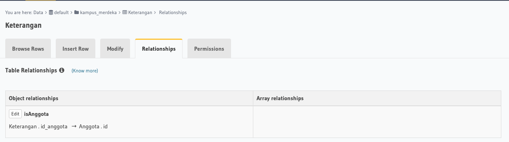
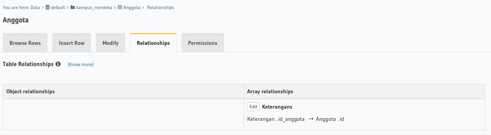

## Resume Materi 
### Relational Database

> Tuliskan 3 poin yang dipelajari dari materi tersebut. Resume / ringkasan materi dapat disubmit melalui Github
1.  Relasi berfungsi sebagai penanyambung antar database
2.  Relasi juga sangat diperlukan karena memudahkan mengetahui dimana sebuah field tersambung
3.  banyak query dalam database yang dapat membantu dalam sebuah database

> Resume Materi
-   Database
    -   Relasi dalam database :
        1.  One to One 
            -   satu user hanya punya satu profil
        2.  One to Many
            -   satu user punya satu / banyak postingan
        3.  Many to Many
            -   1 user punya banyak followers, dan 1 user bisa banyak follow user lain
-   RDBMS (Relation Database Management System)
    -   Jenis SQL
        1.  DDL => Data Definition Language
        2.  DML => Data Manipulation Language
        3.  DCL => Data Control Language
    -   Tipe Data
        1.  Numeric
        2.  Huruf
        3.  Date
-   DML Statement
    -   Statement :
        -   Insert
        -   Select
        -   Update
        -   Delete
        -   Like Between
        -   AND / OR
        -   ORDERBY / GROUPBY
        -   LIMIT
        -   JOIN : 
            1.  INNER JOIN
            2.  OUTTER JOIN
            3.  LEFT / RIGHT JOIN
        -   UNION
    -   Aggregate
        -   Fungsi di mana nilai beberapa baris dikelompokkan bersama untuk membentuk nilai ringkasan tunggal
        -   Fungsi :
            -    MIN
            -   MAX
            -   SUM
            -   AVG
            -   COUNT
            -   HAVING
    -   SubQuery
        -    Subquery atau Inner query atau Nested query adalah query di dalam query SQL lain
        -    digunakan untuk mengembalikan data yang akan digunakan dalam query utama sebagai syarat untuk lebih membatasi data yang akan diambil.
-   PERATURAN
    -   Harus tertutup dalam tanda kurung.
    -   Sebuah subquery hanya dapat memiliki satu kolom pada klausa SELECT, kecuali beberapa kolom yang di query utama untuk subquery untuk membandingkan kolom yang dipilih.
    -   Subqueries yang kembali lebih dari satu baris hanya dapat digunakan dengan beberapa value operator, seperti operator IN.
    -   Daftar SELECT tidak bisa menyertakan referensi ke nilai-nilai yang mengevaluasi ke BLOB, ARRAY, CLOB, atau NCLOB.
    -   Sebuah subquery tidak dapat segera tertutup dalam fungsi set.
-   Function
    -    sebuah kumpulan statement yang akan mengembalikan sebuah nilai balik pada pemanggilnya

> Taks Relational Database
#### Soal
##### [Link Soal](https://docs.google.com/document/d/10l_iKfLUA0VZo8RpTfgvIN53K18XiDM7FrWrmztv5fI/edit)

#### Jawaban
#### Relasi

