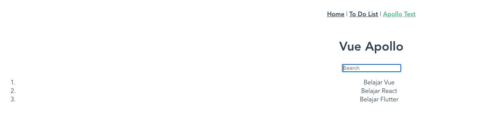
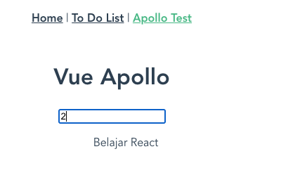

## Resume Materi 
### Relational Database

> Tuliskan 3 poin yang dipelajari dari materi tersebut. Resume / ringkasan materi dapat disubmit melalui Github
1.  Untuk memakai GraphQl kita hatus memakai Apollo
2.  GraphQL sebagai database 
3.  GraphQL Query berguna untuk mengambil data dari database

> Resume Materi
-   Query GraphQL
    -   berguna untuk mengambil data
    -   untuk mengambil data via rest GraphQl harus menggunakan apollo
    -   untuk menampilkan data yang diambil bisa menggunakan template

> Taks Relational Database
#### Soal
##### [Link Soal](https://docs.google.com/document/d/1adlkVrgw52__qGZdXFAJoCuCCA0xCq8tSyArmNAjeOY/edit)

#### Jawaban

