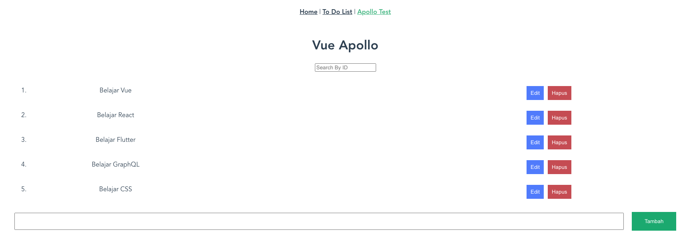

## Resume Materi 
### Understanding GraphQL Mutation

> Tuliskan 3 poin yang dipelajari dari materi tersebut. Resume / ringkasan materi dapat disubmit melalui Github
1.  Untuk memakai GraphQl kita hatus memakai Apollo
2.  GraphQL sebagai database 
3.  GraphQL Mutation berguna untuk menambah, mengubah , menghapus data

> Resume Materi
-   Mutation GraphQL
    -   berguna untuk menambah, mengubah, menghapus sebuah data
    -   untuk mengambil data via rest GraphQl harus menggunakan apollo
    -   untuk menampilkan data yang diambil bisa menggunakan template

> Taks Understanding GraphQL Mutation
#### Soal
##### [Link Soal](https://docs.google.com/document/d/1adlkVrgw52__qGZdXFAJoCuCCA0xCq8tSyArmNAjeOY/edit)

#### Jawaban
#### [Link App](../todo-list/src/views/ApolloView.vue)
