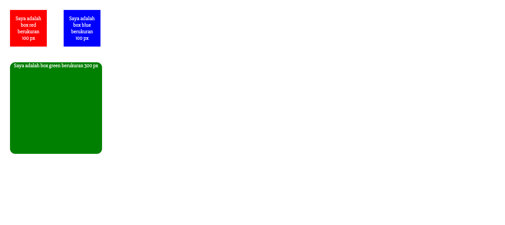
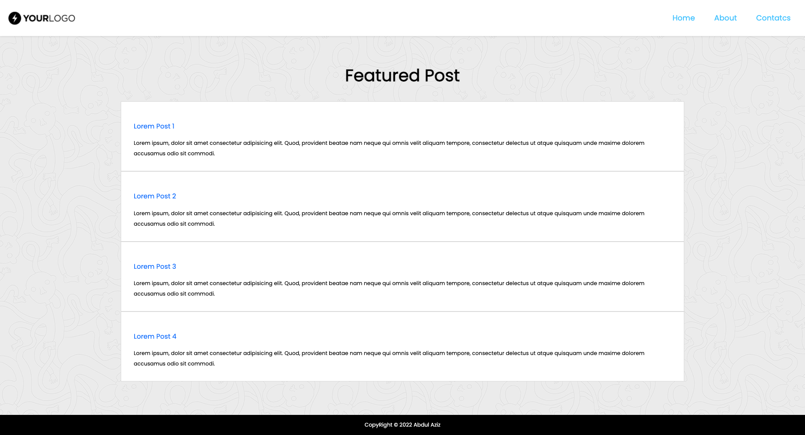

## Resume Materi 
### CSS

> Tuliskan 3 poin yang dipelajari dari materi tersebut. Resume / ringkasan materi dapat disubmit melalui Github
1. memisahkan antara struktur halaman dan styling sebuah halaman web
2. dapat dipanggil dimana pun (inline,internal,external) dan itu sangat membantu
3. karena bisa berbeda halaman (external) makanya kita bisa fokus kustom website tanpa binggung halaman konten (HTML) rusak/terganggu

> Resume Materi CSS
-   Css adalah singkatan dari Cascading Style Sheets
-   Css digunakan untuk menghias/mengatur style pada sebuah halaman website
-   Ada 3 cara pemakaian CSS , yaitu :
    1.  External CSS (Sebuah file css yang disisipkan pada kedalam tag head )
    2.  Internal CSS (Sebuah css yang dipakai pada halaman yang sama dan ditaro pada style didalam tag head)
    3.  Inline CSS (Css yang digunakan pada elemen tunggal HTML)
-   Penulisan Syntax CSS sbagai berikut :
    ` h1 { color: pink  };` = h1 -> Selector , color -> property , pink -> value
-   Ada 2 CSS selector :
    1.  ID (#)
        -   Setiap Elemen hanya dapat mempunyai 1 tag id
        -   Satu halaman hanya ada 1 tag id dengan nama yang sama
    2.  Class (.)
        -   Tag Class boleh dipakai berulang ulang
        -   Satu elemen boleh banyak class yang berbeda beda
-   dan ada banyak property CSS lainya

> Task CSS

#### [Link Soal](https://docs.google.com/document/d/1RFrqbkqwNSf9vWmV2ujNNlm0MWbZhXOrzi0H6yplXZk/edit)

##### Berikut Halaman Tasknya

##### File 1
##### [index.html](./Praktikum/file1.html)

##### File 2
##### [index.html](./Praktikum/file2.html)

> Output Halaman Task CSs

