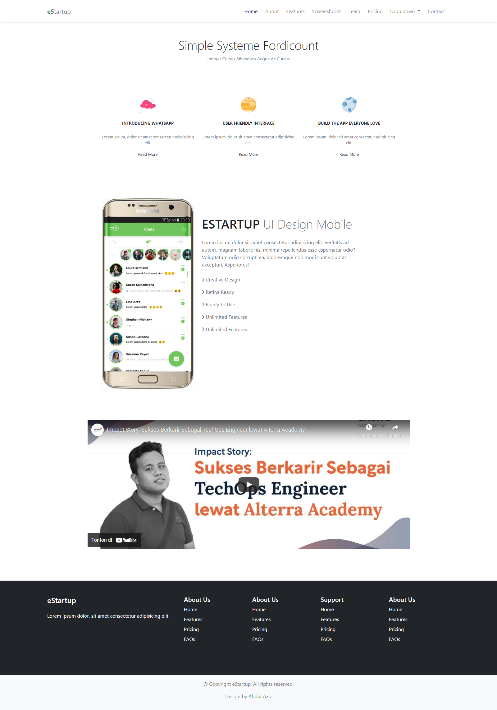

## Resume Materi 
### Bootstrap

> Tuliskan 3 poin yang dipelajari dari materi tersebut. Resume / ringkasan materi dapat disubmit melalui Github
1. Bootsrap sangat membantu dalam styling dan grid system dalam suatu website
2. Penggunaan Bootsrap juga sangat mudah dengan menggunakan class name
3. Perancangan website jadi lebih mudah dan efisien waktu dan tenaga dengan menggunakan Bootsrap

> Resume Materi Bootrsrap
##### Beberapa poin tentang bootsrap 
-   Jika ingin memakai bootrap harus menggunakan file style dari bootrap itu sendiri atau menggunakan link CDN
-   Bootsrap adalah template CSS yang untuk pengembangan style website
-   mempunyai banyak kelebihan yaitu :
    1.  Gratis
    2.  Open Source
    3.  Mudah digunakan
    4.  Desain Responsif
    5.  Fleksibel

##### Cara Menggunakan Bootrap :

###### semua bisa diakses melalui class yang ada
&nbsp;

> Task Bootsrap
##### [Link Soal](https://docs.google.com/document/d/1HlS8tK1b8HfobjdVQELTFv_GCKAkMOpjKXm9vYLSaw4/edit)

##### [Hasil Task](./Praktikum/index.html)
&nbsp;

> Output Hasil

